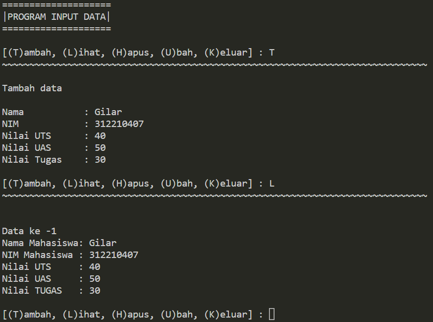
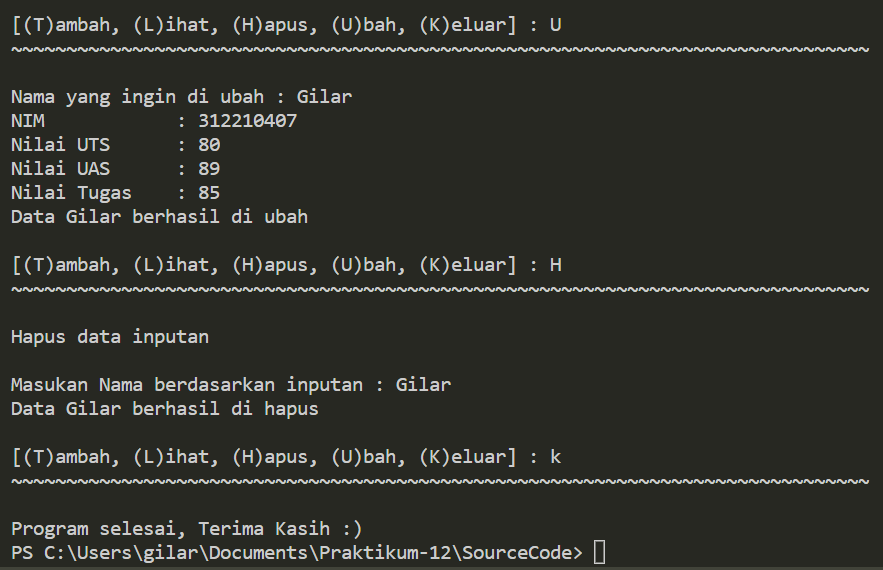

# Pertemuan-12
# OOP

## Profil
| Variable | Isi |
| -------- | --- |
| **Nama** | Gilar Sumilar |
| **NIM** | 312210407 |
| **Kelas** | TI.22.A.4 |
| **Mata Kuliah** | Bahasa Pemrograman |

### Tugas Praktikum
Buat program sederhana dengan mengaplikasikan penggunaan class. Buatlah 
class untuk menampilkan daftar nilai mahasiswa, dengan ketentuan:
- Method tambah() untuk menambah data
- Method tampilkan() untuk menampilkan data
- Method hapus(nama) untuk menghapus data berdasarkan nama
- Method ubah(nama) untuk mengubah data berdasarkan nama

``` Python
class mahasiswa():
    def __init__(self):
        self.nama = []
        self.nim = []
        self.uts = []
        self.uas = []
        self.tugas = []
```
- Membuat `class mahasiswa():` dengan instance class  

```  Python
    # Menambahkan data inputan 
    def tambah(self):
        print("Tambah data\n")
        nama    = input("Nama           : ")
        self.nama.append(nama)
        nim     = int(input("NIM            : "))
        self.nim.append(nim)
        uts     = int(input("Nilai UTS      : "))
        self.uts.append(uts)
        uas     = int(input("Nilai UAS      : "))
        self.uas.append(uas)
        tugas   = int(input("Nilai Tugas    : "))
        self.tugas.append(tugas)
```
- Menambahkan method / fungsi, pada data inputan `Nama`, `NIM`, `UTS`, `UAS`, `Tugas`.


``` Python
    # Menampilkan seluruh data 
    def lihat(self):
        for i in range(len(self.nama)):
            print(f"\nData ke -{i+1}")
            print(f"Nama Mahasiswa: {self.nama[i]}")
            print(f"NIM Mahasiswa : {self.nim[i]}")
            print(f"Nilai UTS     : {self.uts[i]}")
            print(f"Nilai UAS     : {self.uas[i]}")
            print(f"Nilai TUGAS   : {self.tugas[i]}")
```
- Menampilkan method / fungsi. `f` = Format

``` Python
        # Menghapus inputan nama
    def hapus(self, nama):
        print("Hapus data inputan")
        nama = (input("\nMasukan Nama berdasarkan inputan : "))
        if nama in self.nama:
            print("Data {0} berhasil di hapus".format(nama))
            index = self.nama.index(nama)
            del self.nama[index]
            del self.nim[index]
            del self.uts[index]
            del self.uas[index]
            del self.tugas[index]
        else:
            print("NAMA {0} TIDAK ADA!".format(nama))
```

- Menghapus data yg sudah di input. `del self.nama[index]` = menghapus nama
- `[index]` Berfungsi agar inputan menjadi onject

``` Python    
        # Mengubah data nama inputan
    def ubah(self, nama):
        nama = input("Nama yang ingin di ubah : ")
        if nama in self.nama:
            index = self.nama.index(nama)
            self.nim[index]     = int(input("NIM            : "))
            self.uts[index]     = int(input("Nilai UTS      : "))
            self.uas[index]     = int(input("Nilai UAS      : "))
            self.tugas[index]   = int(input("Nilai Tugas    : "))

            print("\nData {0} berhasil di ubah".format(nama))
        else:
            print("NAMA {0} TIDAK ADA!".format(nama))
```
- Mengubah data yg sudah di input
- `index = self.nama.index(nama)` Membuat variable index dengan `self.nama` di dalam ny

``` Python
print("="*20)
print("|PROGRAM INPUT DATA|")
print("="*20)

data = mahasiswa()

while True: 
    print()
    menu = input("[(T)ambah, (L)ihat, (H)apus, (U)bah, (K)eluar] : ")
    print("~"*78)
    print()

    if menu.lower() == 't':
        data.tambah()

    elif menu.lower() == 'l':
        if data.nama:
            data.lihat()
        else:
            print("BELUM ADA DATA!, pilih [T/t] untuk menambah data")       

    elif menu.lower() == "h":
        data.hapus(data.nama)


    elif menu.lower() == "u":
        data.ubah(data.nama) 

    elif menu.lower() == "k":
        print("Program selesai, Terima Kasih :) ")
        break

    else:
        print("\n INPUT {} TIDAK ADA!, Silakan pilih [T/L/H/U/K] untuk menjalankan program!".format(menu))
```
- Perulangan dengan memilih [T/L/H/U/K] untuk menjalankan program apa yg ingin di gunakan.

### Hasil Program 

#### Menambahkan data & Melihat data  


#### Mengubah & menghapus data

